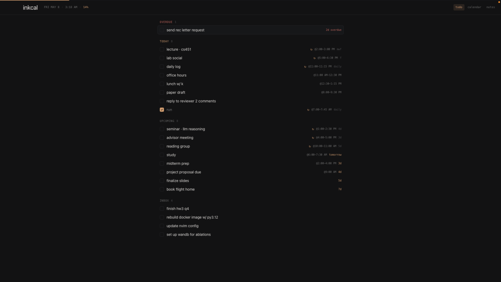
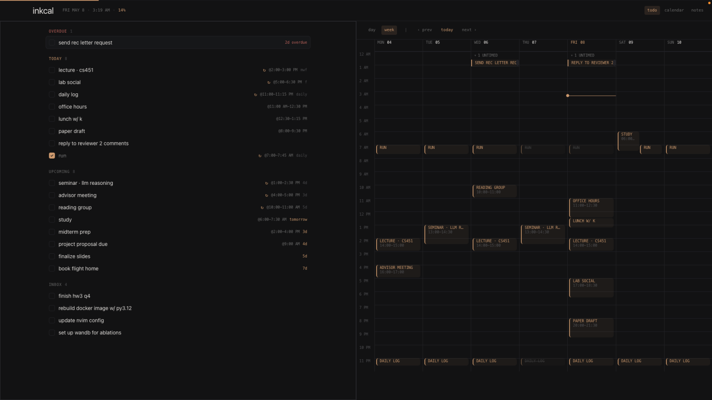
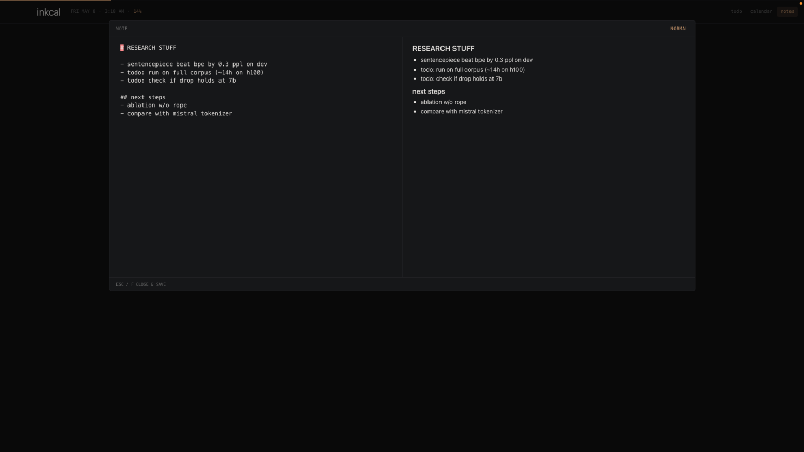
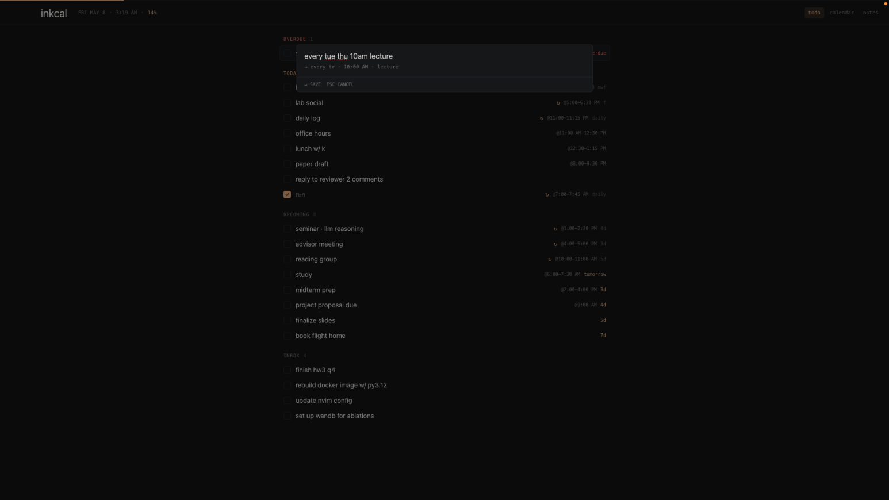

# inkcal.sh

calm vim notetaking

### todos



### split view



### notes



### language parsing



## "App is damaged"

fix by running (i'll fix this once i can pay for a key lol):

```sh
xattr -cr /Applications/inkcal.app
```

## Code signing error on auto-update

the application got renamed to inkcal.app so just redownload from releases and delete the old inkcal.sh.app


## capture syntax (⌘K)

natural language goes through [chrono](https://github.com/wanasit/chrono)

```
today write report                    todo due today
next friday call mom                  todo, chrono parses the date phrase
2026-05-12 pay rent                   todo on a specific date
tomorrow at 2pm meeting               todo due tomorrow at 14:00
may 6 at noon doctor appt             chrono natural-language

every friday at 10 yoga               recurring fri at 10:00
mondays and wednesdays 09:00-10:00 standup
mwf 10:00-11:00 lecture               recurring shortcut (mon/wed/fri)
daily at 8 stretch                    recurring every day at 08:00
every weekday at 9 standup            recurring mon-fri
every weekend brunch                  recurring sat/sun
mon, wed, fri at noon lunch           comma/slash lists also work

note: random thought                  note
random idea                           bare → inbox (no schedule)
```

day combos use single letters: `m t w r f s u` (r = thursday, u = sunday). e.g. `tr` = tue+thu. combos require 2+ letters; a single weekday word (`monday`) parses as a one-off via chrono. use the plural form (`mondays`) or `every monday` to mean recurring.

time forms accepted: `10:00`, `10:00-11:00`, `at 10`, `at 10am`, `at 10:30pm`, `at noon`, `at midnight`, `from 10 to 11`, `10am-11am`.

`every other`, `every 2 weeks`, monthly/yearly anchors, and "until X" bounds aren't supported.

## keys

**global**

| key      | action                              |
|----------|-------------------------------------|
| ⌘1 / ⌘2 / ⌘3 | todo / calendar / notes         |
| ⌘K       | capture                             |
| ⌘P       | command palette                     |
| ⌘,       | settings                            |
| ⌘\       | toggle split view                   |
| ⌃W       | swap focused pane (when split)      |
| /        | search                              |
| A        | open archive                        |
| u        | undo                                |
| ⌃R       | redo                                |
| ⌘⇧Space  | toggle window from anywhere         |
| Esc      | close any open overlay              |

**todo & notes lists**

| key       | action                                |
|-----------|---------------------------------------|
| j / k     | move down / up                        |
| gg / G    | top / bottom                          |
| ⌃d / ⌃u   | half-page down / up                   |
| zz / zt / zb | center / top / bottom of viewport  |
| space, x  | toggle done                           |
| dd  /  ⌫  | delete                                |
| o         | new todo for today                    |
| n         | new note (notes view)                 |
| i         | rename selected (inline)              |
| e         | edit properties (todo view)           |
| f         | open note in focus mode (notes view)  |

**note focus mode (`f` on a note)**

opens the note in a centered editor with optional live markdown preview (toggle in settings). vim bindings apply if vim mode is on. `esc` (or `f` when not in the editor) saves and closes.

**calendar**

| key       | action                       |
|-----------|------------------------------|
| h / l     | prev / next (day or week)    |
| t         | jump to today                |
| d / w     | switch to day / week mode    |

inputs accept normal typing. `Enter` submits, `Esc` cancels.

## search

press `/` to open a scoped fuzzy search:

- **todo / calendar views** → search across all todos and recurring tasks
- **notes view** → search note bodies

`↑/↓` (or `⌃p/⌃n`) move, `↵` jumps to the matching item in its view, `Esc` cancels. archived items show a `done` or `deleted` hint and `↵` opens them in the archive modal.

## archive

`dd` is a soft delete. completing a one-off todo also takes it out of the active list. both end up in the archive, openable with `A` (or the palette).

| key       | action                                |
|-----------|---------------------------------------|
| j / k     | move down / up                        |
| x, space  | restore (uncomplete or undelete)      |
| dd  /  ⌫  | delete forever                        |
| e         | edit properties                       |
| i         | rename inline                         |
| Esc       | close                                 |

## themes

three ship by default: `dark`, `pink`, `light`. switch via ⌘P → `theme pink` etc.

themes are JSON files at `~/Library/Application Support/inkcal-sh/themes/`. drop a new `.json` in there → it appears in the palette automatically (hot reload). bundled themes are copied into that folder on first run.

minimum theme:

```json
{
  "name": "mytheme",
  "vars": {
    "--bg": "#101010",
    "--text": "#eee",
    "--accent": "#d4a574"
  },
  "transparency": { "enabled": false }
}
```

every CSS var in `src/renderer/styles/globals.css` is overridable. macOS vibrancy:

```json
"transparency": { "enabled": true, "vibrancy": "under-window", "alpha": 0.85 }
```

⌘P → `enable/disable transparency` toggles it for the active theme.

## data

a single human-readable file:

```
~/Library/Application Support/inkcal-sh/data.json
```

⌘P → `reveal data.json` to open it. `export data` writes a copy anywhere; `import data` swaps in another file (current state is backed up first). daily snapshots are kept in `backups/` for 30 days.

## stack

electron-vite · react · tailwind · zustand · chrono-node · fuse.js · single json.

## run

```sh
npm install
npm run dev      # dev with HMR
npm run dist     # build a packaged .dmg locally
```

## release

```sh
npm run release             # patch bump (0.1.0 -> 0.1.1)
npm run release minor       # minor bump
npm run release 1.2.3       # explicit version
npm run release -- --local  # build + install locally, no git/publish
```

needs `gh` logged in. bumps the version, builds, uploads dmg/zip/`latest-mac.yml` to a github release, drops the new `.app` into `/Applications`, commits, pushes the tag.

installed copies poll `inkitori/inkcal.sh` on launch and every 6h via [electron-updater](https://www.electron.build/auto-update). downloads happen in the background and apply on next quit. ⌘P → `about` shows version + update status, ⌘P → `check for updates` forces it.

builds are unsigned (ad-hoc only) so first launch macOS yells "unidentified developer". right-click → open → open.
